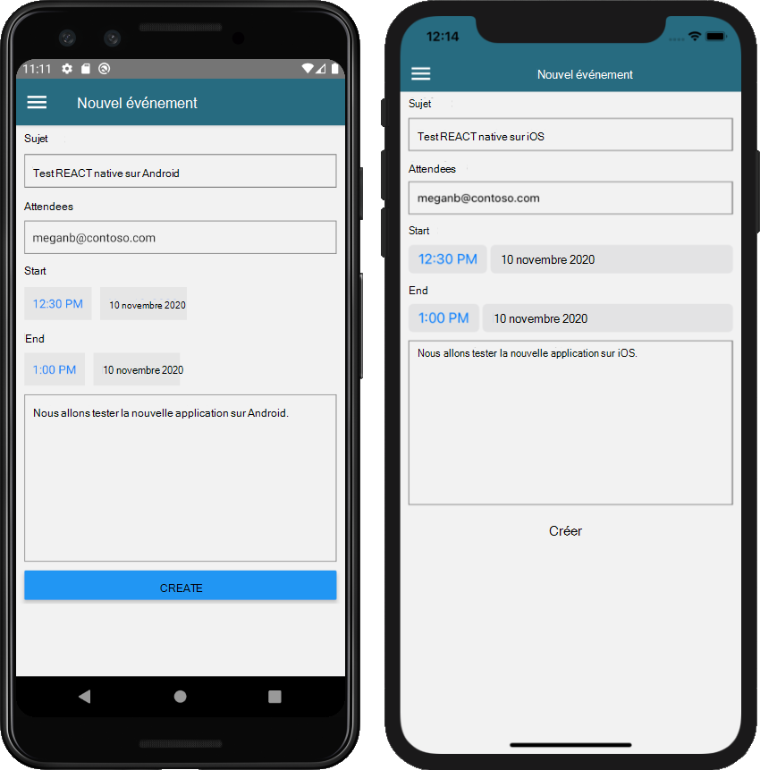

<!-- markdownlint-disable MD002 MD041 -->

<span data-ttu-id="5f39e-101">Dans cette section, vous allez ajouter la possibilité de créer des événements dans le calendrier de l’utilisateur.</span><span class="sxs-lookup"><span data-stu-id="5f39e-101">In this section you will add the ability to create events on the user's calendar.</span></span>

## <a name="create-the-new-event-screen"></a><span data-ttu-id="5f39e-102">Créer l’écran des événements</span><span class="sxs-lookup"><span data-stu-id="5f39e-102">Create the new event screen</span></span>

1. <span data-ttu-id="5f39e-103">Ouvrez **./Graph/GraphManager.TS** et ajoutez la fonction suivante à la `GraphManager` classe.</span><span class="sxs-lookup"><span data-stu-id="5f39e-103">Open **./graph/GraphManager.ts** and add the following function to the `GraphManager` class.</span></span>

    :::code language="typescript" source="../demo/GraphTutorial/graph/GraphManager.ts" id="CreateEventSnippet":::

    <span data-ttu-id="5f39e-104">Cette fonction utilise le kit de développement logiciel (SDK) Graph pour créer un événement.</span><span class="sxs-lookup"><span data-stu-id="5f39e-104">This function uses the Graph SDK to create a new event.</span></span>

1. <span data-ttu-id="5f39e-105">Créez un fichier au format **./Screens** nommé **NewEventScreen. TSX** et ajoutez le code suivant.</span><span class="sxs-lookup"><span data-stu-id="5f39e-105">Create a new file in the **./screens** named **NewEventScreen.tsx** and add the following code.</span></span>

    :::code language="typescript" source="../demo/GraphTutorial/screens/NewEventScreen.tsx" id="NewEventScreenSnippet":::

    <span data-ttu-id="5f39e-106">Tenez compte de ce que `createEvent` fait la fonction.</span><span class="sxs-lookup"><span data-stu-id="5f39e-106">Consider what the `createEvent` function does.</span></span> <span data-ttu-id="5f39e-107">Il crée un `MicrosoftGraph.Event` objet à l’aide des valeurs du formulaire, puis transmet cet objet à la `GraphManager.createEvent` fonction.</span><span class="sxs-lookup"><span data-stu-id="5f39e-107">It creates a `MicrosoftGraph.Event` object using the values from the form, then passes that object to the `GraphManager.createEvent` function.</span></span>

1. <span data-ttu-id="5f39e-108">Ouvrez **./menus/DrawerMenu.TSX** et ajoutez l' `import` instruction suivante en haut du fichier.</span><span class="sxs-lookup"><span data-stu-id="5f39e-108">Open **./menus/DrawerMenu.tsx** and add the following `import` statement at the top of the file.</span></span>

    ```typescript
    import NewEventScreen from '../screens/NewEventScreen';
    ```

1. <span data-ttu-id="5f39e-109">Ajoutez le code suivant à l’intérieur de l' `<Drawer.Navigator>` élément, juste au-dessus de la `</Drawer.Navigator>` ligne.</span><span class="sxs-lookup"><span data-stu-id="5f39e-109">Add the following code inside the `<Drawer.Navigator>` element, just above the `</Drawer.Navigator>` line.</span></span>

    ```typescript
    { userLoaded &&
      <Drawer.Screen name='NewEvent'
        component={NewEventScreen}
        options={{drawerLabel: 'New event'}} />
    }
    ```

1. <span data-ttu-id="5f39e-110">Enregistrez vos modifications et redémarrez ou actualisez l’application.</span><span class="sxs-lookup"><span data-stu-id="5f39e-110">Save your changes and restart or refresh the app.</span></span> <span data-ttu-id="5f39e-111">Sélectionnez l’option **nouvel événement** dans le menu pour accéder au nouveau formulaire événement.</span><span class="sxs-lookup"><span data-stu-id="5f39e-111">Select the **New event** option on the menu to get to the new event form.</span></span>

1. <span data-ttu-id="5f39e-112">Remplissez le formulaire et sélectionnez **créer**.</span><span class="sxs-lookup"><span data-stu-id="5f39e-112">Fill in the form and select **Create**.</span></span>

    
